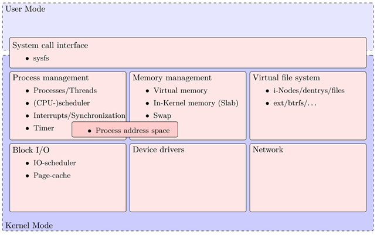
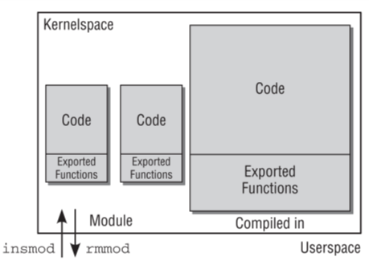

# Справочная информация

ЯдроLinux разделено на несколько подсистем обрабатывающих одну специфическую задачу операционной системы. Главная задача операционной системы — организация взаимодействия между пользователем и компьютером. На рисунке 2.1.1 представлен обзор наиболее распространенных подсистем. 

Для связи с пользовательским пространством ядро Linux использует концепцию системных вызовов. Они представляют собой функции написанные на языке программирования C, которые преобразуются в вызовы ассемблера, чтобы привести процессор в привилегированный режим. На самом деле интерфейс системных вызовов является не подсистемой, а частью всего ядра.

Основной задачей операционных систем управления является управления процессами. Подсистема управления процессами определяет принцип взаимодействия между процессами. Центральный процессор – это ограниченный ресурс, поэтому для его распределения необходим планировщик. С помощью техники прерываний ядро Linux быстро переключается между задачами. Это требует некоторых механизмов синхронизации поскольку связано с временными затратами при переключении контекста. 

Процессам и самому ядру нужна память для работы. Но память тоже ограничена да процессы не всегда дружелюбны. Они могут быть вредоносными или работать с ошибками. Таким образом ядро вмешивается и определяет отображения в памяти тем самым изолируя память для каждого процесса. 

Жесткий диск – это просто большая куча блоков, где можно хранить данные. Для доступа к этим данным необходима некоторая структура, именуемой файловой системой. Было разработано много файловых систем, и Linux поддерживает многие из них. Чтобы предотвратить использование специфичных для файловой системы программ пользовательского пространства, ядро имеет абстрактный уровень, который обеспечивает один и тот же интерфейс для всех файловых систем. В роли данного абстрактного уровня выступает виртуальная файловая система. Теоретически доступ к жестким дискам осуществляется случайно. Но на практике, доступ к последовательным блокам осуществляется быстрее нежели к случайным. Поэтому ядро осуществляет некую сортировку запросов доступа к блочным устройствам для повышения производительности. 

Хорошая операционная система поддерживает множество аппаратного обеспечения. Для поддержки разного оборудования ядро Linux определяет интерфейс для драйверов устройств, который позволяет написать специфический код для конкретного оборудования, но, чтобы работать, используя общий способ работы с ними. 

Доступ к сетям являться важной частью компьютеров, но не обязательно относиться ядру. Тем не менее, он является частью ядра, потому что это единственное место, где сети осуществляется достаточно быстро. Ядро Linux является монолитным, но несмотря на это имеет поддержку загрузки модулей. Такая концепция дает возможность добавить функциональность без повторной компиляции. Модули представляют собой заранее двоичные файлы. В таком случае производителям не применяется требование раскрывать исходный код модуля согласно лицензии GNU. 

Ядро Linux собрало в себе преимущества монолитного ядра и микроядра. Монолитность важных функция обеспечивает хорошую производительной, а модульность гибкость. Модули бываю разные, но разделяются на классы в зависимости от специфики выполняемой ими задачи. Классифицируются модули в зависимости от принадлежности к той или иной подсистемы ядра Linux . В операционной системе Windows аналогом модулей в ядре Linux является драйвера. Существуют также модули безопасности, которые дополняют уже присутствующие в ядре средства защиты. Модули динамически подключаються к работающему ядру. По умолчанию ядро не поддерживает файловую систему NTFS, но её поддержку можно добавить, загрузив соответствующий модуль. 

В отличии от обычной программы, которая может использовать любые библиотеки, загружаемые модули могут использовать только встроенные функции ядра. При этом не все функции ядра модуль может использовать. Загружаемые модули могут предоставлять доступ к своим функциям другим модулям используя директиву «EXPORT \(\)». Есть возможность ограничить использование некоторых функций с помощью директивы «EXPORT\_GPL \(\)» в модулях, которые публикуются под лицензией GPL. На рисунке 2.1.2 показан общий вид модулей в ядре Linux.

Любая программа начинает свою работу с функции «main\(\)», выполняет необходимую работу и завершается после её выполнения. Алгоритм работы модулей отличен. Начинает он всегда либо с функции «init\_module», либо с функции, имя которой оказывается при вызове функции «modile\_init». Эта функция входа для модулей; она сообщает ядру о функциях, предоставляемых модулем, и производит настройку ядра для запуска модуля. После этого модуль ожидает действий со стороны ядра. Все модули заканчиваются вызовом функции «cleanup\_module» или функции, имя которой было указано при вызове «module\_exit» \[5\]. Она отзывает ранее экспортированные функции модуля. Каждый модуль должен иметь функцию входа и функцию выхода. При глобальном изменении структуры ядра Linux необходимо адаптировать под него код модуля. В случае насилия исходного кода это не представляется возможным. А в случае его отсутствия необходимо ждать, когда производитель выпустить совместимую версию модуля.

В ядре Linux есть механизм, предотвращающий загрузку модуля ядра. Данных механизм работает, используя файл, где хранятся название модулей, загрузка которых запрещена. Это нужно если какое-то оборудование не нужно или не используется. Можно использовать данный список для защиты от вредоносных модулей, которые имеют устоявшееся название. Обычно загрузка вредоносных модулей происходит по инициативе либо пользователя, либо вредоносного программного обеспечения использующей уязвимость в операционной системе. ыва

Для реализации простого модуля необходимы следующие пакеты: build-essential и linux-headers. Установить их можно в операционной системе Ubuntu их можно установить с помощью установщика пакетов «apt-get». Обычно код модуля включает в себя основные библиотеки включающие в себя функции ядра Linux. К примеру: «linux/init.h», «linux/module.h», «linux/kernel.h». Библиотека «linux/init.h», содержит в себе функции для инициализации модуля в ядре. Библиотека «linux/module.h», содержит в себе функции для управления модулем в ядре. Библиотека «linux/kernel.h», содержит в себе функции для взаимодействия с ядром. Модуль должен содержать информацию о лицензии, об авторе, простое описание его работы и версию модуля. Данную информацию содержат все модули и в операционной системе можно узнать кому принадлежит модуль и по какой лицензии он распространяется. 1.2 Способы

