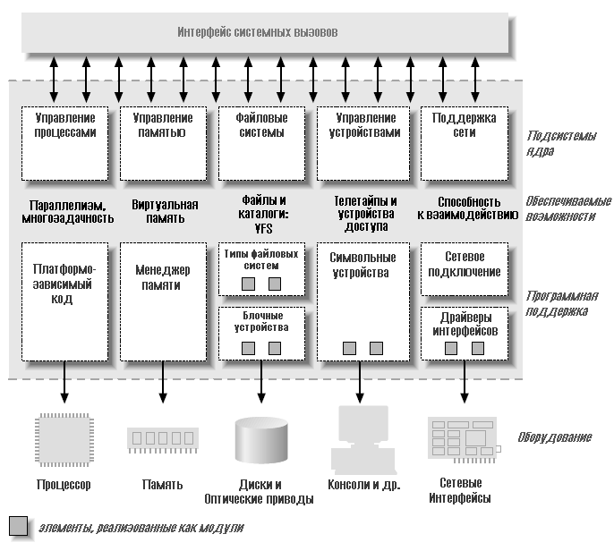

# Справочная информация

## Строение ядра Linux

В системе Unix несколько параллельных процессов обслуживают разные задачи. Каждый процесс запрашивает системные ресурсы, будь то энергия, память, сетевое подключение, или какие-то другие ресурсы. Ядро - это большой кусок исполняемого кода, отвечающего за обработку всех таких запросов. Хотя границы между разными задачами ядра не всегда ясно определены, роль ядра может быть разделена \(как показано на Рисунке 1-1\) на следующие части:

#### Управление процессами

Ядро отвечает за создание и уничтожение процессов и обеспечение их взаимодействия с внешним миром \(ввод и вывод\). Взаимодействие между разными процессами \(через сигналы, каналы или примитивов межпроцессных взаимодействий\) является основой общей функциональности системы и также возложена на ядро. Дополнительно, планировщик, который распределяет время процессора, тоже является частью системы управления процессами. В общих словах, деятельность процессов управления ядра создаёт абстракцию нескольких процессов поверх одного или нескольких процессоров.

#### Управление памятью

Память компьютера - главный ресурс и способ управления ей особенно важен для производительности системы. Ядро создаёт виртуальное адресное пространство для каждого процесса поверх имеющихся ограниченных ресурсов. Разные части ядра взаимодействуют с подсистемой управления памятью через набор функциональных вызовов, начиная от простой пары malloc/free до много более развитой функциональности.

#### Файловые системы

Unix очень сильно связана с концепцией файловой системы; почти всё в Unix может быть обработано как файл. Ядро строит структурированную файловую систему поверх неструктурированного оборудования и полученная файловая абстракция интенсивно используется всей системой. В дополнение Linux поддерживает множество типов файловых систем, то есть различные способы организации данных на физическом носителе. К примеру, диски могут быть отформатированы в стандартной для Linux файловой системе ext3, часто используемой файловой системе FAT или некоторых других.

#### Управление устройствами

Почти каждая системная операция в конечном счёте связывается с физическим устройством. За исключением процессора, памяти и очень немногих других объектов, каждая операция управления устройством выполняются кодом, специфичным для данного адресуемого устройства. Этот код называется драйвером устройства. Ядро должно иметь встроенный драйвер устройства для каждой периферии, существующей в системе, от жёсткого диска до клавиатуры и ленточного накопителя. Этот аспект функциональности ядра и является нашим основным интересом в этой книги.

#### Сетевое подключение

Сетевое подключение должно управляться операционной системой, потому что большинство сетевых операций не зависят от процессов: входящие пакеты - это асинхронные события. Эти пакеты должны быть собраны, распознаны и распределены перед тем, как они будут переданы другому процессу для обработки. Система отвечает за доставку пакетов данных между программой и сетевыми интерфейсами и должна управлять исполнением программ в зависимости от их сетевой активности. Дополнительно в ядро встроены все задачи маршрутизации и разрешение адресов.

## Загружаемые модули

Одной из хороших особенностей Linux является способность расширения функциональности ядра во время работы. Это означает, что вы можете добавить функциональность в ядро \(и убрать её\), когда система запущена и работает.

Часть кода, которая может быть добавлена в ядро во время работы, называется модулем. Ядро Linux предлагает поддержку довольно большого числа типов \(или классов\) модулей, включая, но не ограничиваясь, драйверами устройств. Каждый модуль является подготовленным объектным кодом \(не слинкованным для самостоятельной работы\), который может быть динамически подключен в работающее ядро программой insmod и отключен программой rmmod.

Рисунок 1-1 определяет разные классы модулей, отвечающих за специфические задачи - как говорят, модуль принадлежит к определённому классу в зависимости от предлагаемой функциональности. Картина из модулей, показанная на Рисунке 1-1, охватывает все наиболее важные классы, но далеко не полная, потому что много большая функциональность Linux модулизирована.

## Классы устройств и модулей

Способ видения устройств в Linux разделяется на три фундаментальных типа. Каждый модуль обычно реализован как один из этих типов и таким образом классифицируется как символьный модуль, блочный модуль, или сетевой модуль. Такое разделение модулей на разные типы или классы не является жёстким; программист может при желании создавать большие модули, содержащие разные драйверы в одном куске кода. Хорошие программисты, тем не менее, обычно создают разные модули для каждой новой функциональности, потому что декомпозиция является ключом к масштабируемости и расширяемости.

Этими тремя классами являются:

#### Символьные устройства

Символьное устройство - это такое устройств, к которому можно обращаться как к потоку байтов \(так же как к файлу\); драйвер символьного устройства отвечает за реализацию такого поведения. Такой драйвер обычно, по крайней мере, поддерживает системные вызовы open, close, read и write. Текстовый экран \(/dev/console\) и последовательные порты \(/dev/ttyS0 и подобные\) являются примерами символьных устройств, так как они хорошо представлены абстракцией потока. Для обращения к символьным устройствам используют узлы \(node\) файловой системы, такие как /dev/tty1 и /dev/lp0. Единственное важное отличие между символьными устройствами и обычными файлами - вы всегда можете двигаться вперед и назад в обычном файле, в то время как большинство символьных устройств - это только каналы данных, к которым вы можете обращаться только последовательно. Существуют, однако, символьные устройства, которые выглядят как области данных, и вы можете двигаться по ним назад и вперёд; к примеру, это обычно используется в грабберах экрана, где приложения могут получать доступ ко всему полученному изображению используя mmap или lseek.

#### Блочные устройства

Так же как символьные устройства, блочные устройства доступны через узлы файловой системы в директории /dev. Блочное устройство - это устройство \(например, диск\) который может содержать файловую систему. В большинстве систем Unix блочное устройство может поддерживать только операции ввода-вывода, которые передают один или более целых блоков, обычно равных 512 байт \(или большей степени числа два\). Linux, однако, разрешает приложению читать и писать в блочное устройство, так же как и в символьное устройство - это позволяет передавать любое число байт за раз. В результате, блочные и символьные устройства отличаются только способом управления данными внутри ядра и, соответственно, программным интерфейсом в ядре/драйвере. Как и символьное устройство, каждое блочное устройство доступно через узел файловой системы, так что различия между ними не видны пользователю. Блочные драйверы имеют интерфейс для ядра полностью отличный от символьных устройств.

#### Сетевые интерфейсы

Любой сетевой обмен данными делается через интерфейс, то есть устройство, которое в состоянии обменяться данными с другими узлами сети. Обычно, интерфейс - это аппаратное устройство, но также он может быть чисто программным устройством, наподобие интерфейса loopback \(локальное петлевое устройство\). Сетевой интерфейс отвечает за отсылку и приём пакетов данных, управляемых подсистемой сети в ядре, без знания кому предназначены передаваемые пакеты.Многие сетевые соединения \(особенно использующие TCP\) являются поточно-ориентированными, но сетевые устройства обычно разработаны для передачи и приёма пакетов. Сетевой драйвер ничего не знает об отдельных соединениях; он только обрабатывает пакеты. Не будучи поточно-ориентированным устройством, сетевой интерфейс нелегко представить как узел в файловой системе наподобие /dev/tty1. Unix всё же обеспечивает доступ к интерфейсам через назначение им уникальных имён \(таких как eth0\), но это имя не имеет соответствующего элемента в файловой системе. Обмен между ядром и сетевым устройством сильно отличается от используемого в символьных и блочных драйверах. Вместо read и write ядро вызывает функции, относящиеся к передаче пакетов.

Есть другие пути классификации модулей драйверов, которые по-другому подразделяют устройства. Вообще, некоторые типы драйверов работают с дополнительными наборами функций ядра для данного типа устройств. К примеру, можно говорить о модулях универсальной последовательной шины \(USB\), последовательных модулях, модулях SCSI, и так далее. Каждое USB устройство управляется модулем USB, который работает с подсистемой USB, но само устройство представлено в системе или как символьное устройство \(последовательный порт USB, к примеру\), или как блочное устройство \(USB устройство чтения карт памяти\), или как сетевой интерфейс \(например, сетевой USB интерфейс\).

В последнее время в ядро были добавлены другие классы драйверов устройств, включающие драйверы FireWire и I2C. Таким же образом, как они добавили поддержку драйверов USB и SCSI, разработчики ядра собрали особенности всего класса и передали их разработчикам драйверов, чтобы избежать двойной работы и ошибок, упростив и стабилизировав таким образом процесс написания этих драйверов.

В дополнение к драйверам устройств в ядре в виде модулей реализованы и другие функциональные возможности, включающие и аппаратные средства и программное обеспечение. Общий пример - файловые системы. Тип файловой системы определяет, как организована информация на блочном устройстве, чтобы показать дерево файлов и директорий. Это не драйвер устройства, здесь нет какого-либо устройства, связанного со способом размещения информации; вместо этого, тип файловой системы - это программный драйвер, потому что он отображает структуры данных нижнего уровня на структуры данных верхнего уровня. Он и является файловой системой, которая определяет, какой длины может быть имя файла и какая информация о каждом файле хранится в записи каталога. Модуль файловой системы должен осуществить самый низкий уровень системных вызовов, которые обращаются к каталогам и файлам, отображая имена файла и пути \(так же как другую информацию, такую как режимы доступа\) к структурам данных, сохранённым в блоках данных. Такой интерфейс полностью независим от фактической передачи данных на и от диска \(или другого носителя\), что достигнуто с помощью драйвера блочного устройства.

Если вы подумаете о том, как сильно система Unix зависит от нижележащей файловой системы, то вы поймете, что такое программное понятие жизненно важно для функционирования системы. Способность декодировать информацию файловой системы остаётся на самом низком уровне иерархии ядра и имеет предельно важное значение; даже если вы напишете блочный драйвер для своего нового CD-ROM, это будет бесполезно, если вы не в состоянии выполнить команды ls или cp для данных этого устройства. Linux поддерживает понятие модуля файловой системы, программный интерфейс которого декларирует различные операции, которые могут быть выполнены с индексом файловой системы \(inode\), каталогом, файлом и суперблоком. Вряд ли в действительности программисту потребуется написать модуль файловой системы, потому что официальное ядро уже включает код для самых важных типов файловых систем.

## Вопросы безопасности

 Безопасность - всё более и более важная проблема в наше время. Однако, есть несколько общих понятий, которые заслуживают внимания сейчас. Любая проверка безопасности в системе выполняется кодом ядра. Если у ядра есть бреши в защите, то и у системы в целом есть бреши. В официально распространяемом ядре только авторизованный пользователь может загрузить модуль в ядро; системный вызов init\_module проверяет, разрешено ли вызывающему процессу загрузить модуль в ядро. Таким образом, когда работает официальное ядро, только суперпользователь, или злоумышленник, который смог получить эту привилегию, может использовать мощность привилегированного кода. Когда возможно, авторы драйверов должны избегать реализации политики безопасности в своем коде. Безопасность - результат ограничений, которые часто лучше всего обрабатываются на более высоких уровнях ядра, под управлением системного администратора. Однако, всегда есть исключения.

Как автор драйвера устройства, вы должны знать о ситуациях, в которых некоторые способы доступа к устройству могли бы неблагоприятно затронуть систему в целом и должны обеспечить адекватный контроль. Например, операции устройства, которые затрагивают глобальные ресурсы \(такие как установка линии прерывания\), которые могут повредить аппаратные средства \(загрузку встроенного программного обеспечения, например\), или могли бы затронуть других пользователей \(таких как установка заданного по умолчанию размера блока на ленточном накопителе\), обычно доступны только для достаточно привилегированных пользователей, и эта проверка должна быть осуществлена в драйвере непосредственно.

Конечно, авторы драйверов должны также быть внимательными, чтобы избежать внедрения ошибок безопасности. Язык программирования Си позволяет легко делать некоторые типы ошибок. Много текущих проблем безопасности созданы, например, ошибками переполнения буфера, когда программист забывает проверять, сколько данных записано в буфер, и данные продолжают записываться после окончания буфера, поверх совершенно других данных. Такие ошибки могут поставить под угрозу всю систему и их надо избегать. К счастью, обычно относительно просто избежать этих ошибок в контексте драйвера устройства, в котором интерфейс для пользователя чётко определен и строго контролируем.

Стоит иметь в виду и некоторые другие общие идеи безопасности. Любые данные, полученные от пользовательских процессов, должны быть обработаны с большим подозрением; никогда не доверяйте им, пока они не проверены. Будьте внимательны с неинициализированной памятью; любая память, полученная от ядра, должна быть обнулена или проинициализирована другим способом прежде, чем стать доступной пользовательскому процессу или устройству. Иначе, результатом может быть утечка информации \(раскрытие данных, паролей и так далее\). Если ваше устройство обрабатывает данные, посланные в него, убедитесь, что пользователь не может послать ничего, что могло бы поставить под угрозу систему. Наконец, думайте о возможном эффекте операций устройства; если есть определённые операции \(например, перезагрузка встроенного программного обеспечения на плате адаптера или форматирование диска\), которые могли бы затронуть систему, эти операции должны почти наверняка быть разрешены только привилегированным пользователям.

Будьте внимательны также, получая программное обеспечение от третьих лиц, особенно когда затрагивается ядро: потому что любой имеет доступ к исходному тексту, любой может сломать и перекомпилировать части. Хотя вы можете обычно доверять предварительно откомпилированным ядрам в ваших дистрибутивах, вы должны избегать запуска ядра, откомпилированного незнакомыми людьми - если вы избегаете запуска предварительно откомпилированного ядра как root, тогда вам лучше не запускать откомпилированное ядро. Например, злонамеренно изменённое ядро могло бы позволить любому загружать модуль, открывая таким образом неожиданную лазейку через init\_module. Заметьте, что ядро Linux может быть откомпилировано так, чтобы вообще не поддерживать модули, закрывая таким образом любые связанные с модулем бреши в защите. Конечно, в этом случае все необходимые драйверы должны быть встроены непосредственно в само ядро. Отключение загрузки модулей ядра после начальной загрузки системы через соответствующий механизм стало возможно для версий, начиная с 2.2.

