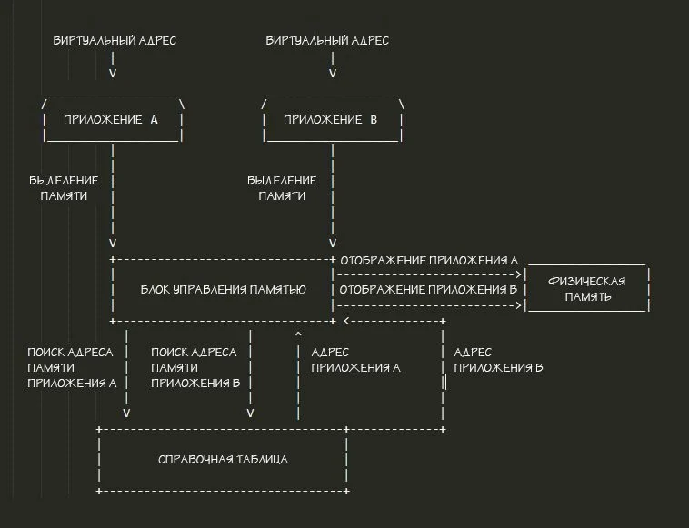
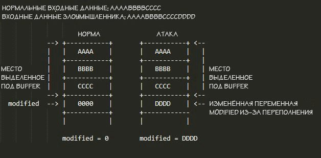

# Справочная информация

### Теория: память приложений

 При выполнении приложения загружаются в память. Но как мы все знаем, компьютеры имеют ограниченное количество памяти, и приложению нужно быть очень осторожным, чтобы не перезаписать область в памяти, принадлежащую другому приложению. Для того, чтобы избежать такой ситуации, используется так называемая виртуальная память, которую можно прекрасно описать с помощью сцены из сериала, выпущенного в начале 2000-х — [Дрейк и Джош](https://ru.wikipedia.org/wiki/%D0%94%D1%80%D0%B5%D0%B9%D0%BA_%D0%B8_%D0%94%D0%B6%D0%BE%D1%88), в котором главные герои раскладывают суши по контейнерам:

`В этой сцене Дрейк и Джош получили работу, в которой суши идут по конвейеру, и их нужно разложить по контейнерам. Более того, несмотря на то, что контейнеры выглядят одинаково, в одном контейнере должен быть только один тип суши.`

Давайте перейдём от аналогии к концепции виртуальной памяти.

**Конвейер с суши**: как уже говорилось ранее, компьютеры имеют ограниченную память и должны быть очень осторожны и точны при записи данных, чтобы не перезаписать память других приложений. Хоть компьютер и может просто записать приложение в физическую память, в конечном итоге это приведёт к проблемам, так как фрагменты приложений быстро заполнят всю свободную память. В примере выше индивидуальные сушинки можно рассматривать как фрагменты приложения или часть памяти, занятой определённым приложением, а набор суши из шести штук — само приложение.

**Дрейк и Джош**: чтобы обойти проблему с заполнением конвейера одиночными сушинками, главные герои разбирают их по разным контейнерам, которые потом отправляют дальше по конвейеру. Ваш компьютер, как Дрейк и Джош, распределяет приложения по контейнерам, называемым виртуальным адресным пространством. Такие виртуальные адресные пространства позволяют приложению считать, что оно имеет полный контроль над всей памятью устройства. Однако когда приложение пытается получить доступ к памяти вне своего виртуального адресного пространства, маленькая, но чрезвычайно важная часть вашего ЦПУ — блок управления памятью — перенаправляет обращение к физической памяти в соответствии с выделенной областью для этого приложения, облегчая таким образом любую работу с памятью. Такое распределение позволяет компьютеру организовать работу сразу нескольких приложений через справочную таблицу с требованиями в виде динамической памяти.



Также важно знать, что код всех приложений содержится внутри их виртуального адресного пространства. Приложения часто используют динамически подключаемые библиотеки \(DLL\), такие как libc или kernel32. DLL — внешние \(т. е. не хранятся в исполняемом файле запускаемого приложения\) системные или специально написанные библиотеки, которыми пользуется приложение. Пример представлен ниже.

```cpp
int main()
{
    printf("Hello World");

    return 0;
}
```

 Как вы видите, нигде в этой шестистрочной программе не объявляется `printf()`. Однако эта программа всё равно запустится без ошибок и выведет «Hello World». Это потому, что функция `printf()` — системная функция, определённая в libc, стандартной библиотеке C. Во время компиляции libc внешне подключается к исполняемому файлу. В системах Linux можно посмотреть используемые программой библиотеки с помощью команды ldd.


 Если вы смотрите на скриншот выше и думаете, что такое 0xb7e99000, то это адрес библиотеки libc в памяти. Адреса в памяти представлены в шестнадцатеричном формате. Более подробно о шестнадцатеричном формате вы можете узнать [здесь](https://inf1.info/hexadecimal).

### Теория: стек

Стек — это просто большая структура данных, которая используется для хранения приложением информации или данных во время её работы. Работу стека можно описать следующей аналогией:

`Боб — мойщик посуды в модном ресторане. Каждый вечер у Боба есть стопка тарелок, которые нужно вымыть. Более того, в течение ночи на верх стопки могут добавляться ещё тарелки, по мере уборки столов. Если Боб возьмёт тарелку откуда-то ещё кроме как сверху стопки, то вся стопка развалится и тарелки разобьются.`

А теперь вместо Боба и стопки тарелок представьте компьютер и стопку объектов с данными. Когда что-то добавляется \(push\) в стек, оно кладётся наверх стопки. Когда извлекается \(pull\), то берётся сверху стопки. Так работает механизм LIFO \(Last In First Out, последним пришёл — первым вышел\).

Стек используется программами для хранения различных вещей, например, указателей на функции и переменных.

### Теория: вызов функций и возвраты

Посмотрите на код, представленный ниже:

```cpp
int add(int A, int B){
    return A + B;
}
int main(){
    add(1, 2);
}
```

 В этом фрагменте кода мы видим что функция `add()` принимает два аргумента целочисленного типа, имена которых `А` и `В`. В функции `main()` мы вызываем функцию `add()` с 1 в качестве аргумента `А` и 2 — `В`. Если перевести это в машинный код:

```cpp
push 2
push 1
call add
```

 Как вы видите, при вызове функции с параметрами программа сначала добавляет оба параметра в стек, а затем выполняет команду `call`. Команда `call` перенаправляет указатель инструкции программы по адресу вызываемой функции. Указатель программы подобен маленькому карандашу, который вы используете для отслеживания слов при чтении. Указатель инструкции всегда указывает на ту инструкцию, которая должна быть выполнена \(слово, которое будет прочитано\). Однако, перед тем, как перейти к вызываемой функции, команда `call` помещает адрес следующей за ним инструкции в стек, чтобы, когда произойдёт возврат из функции `add()`, было известно, с чего продолжать выполнение программы. Адрес места, в которое функция должна вернуться, называется _указателем возврата_ функции.

### Атака: переполнение буфера стека

Прежде чем углубляться в технические подробности о том, что такое переполнение стекового буфера и как оно работает, давайте рассмотрим простую для понимания аналогию:

`Алиса и Боб раньше встречались, но в итоге Алиса рассталась с Бобом. Время шло, Алиса оставила прошлое позади, но Бобу так и не удалось справиться с горем. Теперь Алиса выходит замуж за Роберта Хакермана, заклятого врага Боба. Боб, будучи жутким чудаком, следил за всеми свадебными планами Алисы благодаря своему секретному доступу к электронной почте Алисы. Боб увидел, что Алиса наняла известного дизайнера свадебных тортов, который хотел, чтобы Алиса отредактировала части своего рецепта под свои вкусовые предпочтения. Дизайнер дал Алисе рекомендованный список ингредиентов, которые можно добавить, но сказал, что сделает всё в точности, как она захочет. Боб открыл документ, прикреплённый к электронному письму дизайнера, и увидел, что меняемые строки рецепта выглядят так:`_`… Затем мы наделим глазурь вкусом, добавив _____. После этого мы добавим немного шоколада …`_`Боб заметил, что если ввести «банан» в строку, текст будет выглядеть так:`_`… Затем мы наделим глазурь вкусом, добавив банан. После этого мы добавим немного шоколада …`_`Но если Боб введёт «клубника» в строку, текст будет выглядеть так:`_`… Затем мы наделим глазурь вкусом, добавив клубникуосле этого мы добавим немного шоколада …`_`Боб понял, что это будет идеальный способ испортить свадьбу Алисы, и всё, что ему нужно было сделать, это переписать остальную часть рецепта своей собственной отвратительной версией! В день свадьбы Алисы дизайнер наконец-то показал торт, который он сделал — он был покрыт жуками и сделан из замороженного майонеза!`

Переполнение буфера стека, как и атака Боба, перезаписывает данные, которые разработчик не собирался перезаписывать, обеспечивая полный контроль над программой и её выходными данными.

Итак, теперь давайте посмотрим на это в реальном мире. Взгляните на следующий фрагмент кода:

```cpp
#include <stdlib.h>
#include <unistd.h>
#include <stdio.h>

int main(int argc, char **argv)
{
    volatile int modified;
    char buffer[64];

    modified = 0;
    gets(buffer);
   
    if(modified != 0) {
        printf("You have changed the 'modified' variable\n");
    } else {
        printf("Try again?\n");
    }
}
```

 В приведённой выше функции мы видим, что массив символьного типа с именем `buffer` создаётся с размером 64. Затем мы видим, что переменная `modified` равна 0, и функция `gets()` вызывается с переменной `buffer` в качестве аргумента. Наконец, мы видим оператор `IF`, который проверяет, не равно ли значение `modified` нулю. Очевидно, что нет, где в этом приложении переменная `modified` имеет значение, отличное от 0. Так как мы собираемся её изменить?

 функция `gets()` просто принимает пользовательский ввод. Однако функция не проверяет, действительно ли пользовательский ввод вписывается в структуру данных, в которой мы его храним \(в данном случае это `buffer`\), и, таким образом, мы можем переполнить структуру данных и повлиять на другие переменные и данные стека. Кроме того, поскольку мы знаем, что все переменные хранятся в стеке, и мы знаем, что представляет собой переменная `modified` \(0\), всё, что нам нужно сделать, — это ввести достаточно данных, чтобы перезаписать переменную `modified`. Давайте посмотрим на диаграмму:



 Как видите, если злоумышленник просто вводит слишком много текста, он может перезаписать переменную `modified` и всё остальное в стеке, включая указатели возврата. Это означает, что если злоумышленник сможет взять под контроль стек программы, он сможет эффективно контролировать всю программу и заставить её делать то, что он хочет. Например, можно просто перезаписать указатель возврата функции в стеке на пользовательский, указывающий на вредоносную функцию.

