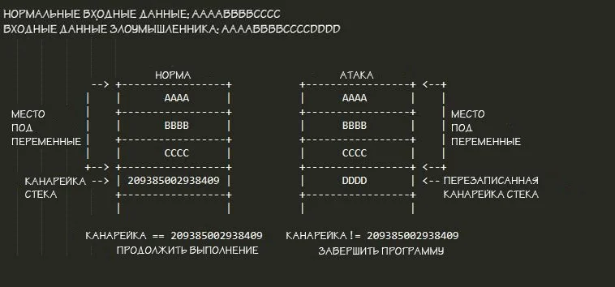

# Механизмы защиты

Наиболее распространенные встроенные в ядро Linux механизмы от несанкционированного исполнения кода в ядре будут рассмотрены в данном разделе.

## LockDown

**Основная функция блокировки - ограничить доступ пользователя root к ядру системы.** и эта функциональность **перенесен в модуль LSM** опционально загружен \(Linux Security Module\), который **устанавливает барьер между UID 0 и ядром**, ограничивая некоторые низкоуровневые функции.

Это позволяет функции блокировки быть основанной на политике, а не жестко закодировать неявную политику внутри механизма. **поэтому блокировка, включенная в модуль безопасности Linux, обеспечивает реализацию с простой политикой** предназначен для общего пользования. Эта политика обеспечивает уровень детализации, управляемый через командную строку ядра.

 **Такая защита доступа к Ядру обусловлена ​​тем, что:**

> Если злоумышленнику удастся выполнить код с привилегиями root в результате атаки, он также может выполнить свой код на уровне ядра, например, заменив ядро ​​на kexec или прочитав и / или записав память через / dev / kmem.

Наиболее очевидным последствием этого действия может быть обход UEFI Secure Boot или восстановление конфиденциальных данных, хранящихся на уровне ядра.

на начальном этапе, **функции ограничения root были разработаны в контексте усиления проверенной защиты загрузки** а в дистрибутивах уже давно используются сторонние патчи для блокировки обхода безопасной загрузки UEFI.

Al mismo tiempo, **такие ограничения не вошли в состав активной зоны из-за разногласий** в его реализации и боязнь нарушения работы существующих систем. Модуль «lockdown» включает исправления, уже используемые в дистрибутивах, которые были обработаны в виде отдельной подсистемы, не привязанной к UEFI Secure Boot.

**При включении ограничиваются различные функции ядра.**. Таким образом, приложения, которые полагаются на низкоуровневое оборудование или доступ к ядру, могут перестать работать в результате, поэтому его не следует включать без предварительной оценки.

В первом случае **заблокированы функции, позволяющие вносить изменения в рабочее ядро ​​из пользовательского пространства,** а во втором случае, помимо этого, отключена функция, которая может использоваться для извлечения конфиденциальной информации из ядра.

**Важно отметить, что блокировка ограничивает только обычные возможности доступа к ядру,** но он не защищает от модификаций в результате использования уязвимостей.

## **Стек "канарейки"**

Такое название пошло из-за аналогии, которая используется для описания данного механизма защиты — канарейка в угольной шахте.

`Примерно в 1913 году Джон Скотт Холдейн предложил использовать канареек или других теплокровных животных в глубоких шахтах для обнаружения угарного газа. Поскольку птицы гораздо более чувствительны к угарному газу, чем люди, то шахтёры, увидев, что птицам стало плохо, узнали бы, что произошла утечка угарного газа, и смогли бы выйти из пещеры.`

Так же, как знаменитая канарейка в угольной шахте, стековые канарейки предупреждают программу о том, что что-то не так, что позволяет программе завершить работу до того, как произойдёт какая-либо вредоносная операция. Это делается следующим образом:

1. Выделяется место для локальных переменных.
2. В конец стека после выделенного места добавляется длинное случайное число.
3. Перед возвратом функции происходит проверка случайного числа. Если канарейка стека была перезаписана атакой переполнения буфера стека, программа завершится.

Такой способ защиты кажется довольно логичным, но он далёк от совершенства.

##  Kernel Address Space Layout Randomization

 **ASLR** \([англ.](https://ru.bmstu.wiki/%D0%90%D0%BD%D0%B3%D0%BB%D0%B8%D0%B9%D1%81%D0%BA%D0%B8%D0%B9_%D1%8F%D0%B7%D1%8B%D0%BA) **a**ddress **s**pace **l**ayout **r**andomization — «рандомизация размещения адресного пространства»\) — технология, применяемая в операционных системах, при использовании которой случайным образом изменяется расположение в адресном пространстве процесса важных структур данных, а именно образов исполняемого файла, подгружаемых библиотек, кучи и стека.

Технология ASLR позволяет размещать системные компоненты в разных областях памяти при каждом запуске операционной системы. Задача этой технологии – внесение случайности в распределение адресов оперативной памяти, используемых приложением. Использование ASLR изменяет расположение в адресном пространстве таких важных структур как образ исполняемого файла, подгружаемых библиотек, кучи и прочего. Использование ASLR приводит к тому, что целый класс атак \(к примеру, переполнение буфера, возврат в библиотеку \(return-to-libc\)\) заканчивается неудачей. Помимо этого технология позволяет обнаруживать подобные атаки, так как в результате неудачных попыток исполнение атакуемого приложения прекращается**.**

Эта технология позволяет сделать разработку эксплойтов гораздо более дорогостоящим мероприятием, поскольку кроме эксплуатации самой уязвимости в ПО злоумышленнику нужно опереться на те или иные предсказуемые адреса в памяти в момент эксплуатации, которых ASLR его лишает. Например, если при помощи переполнения буфера или другим методом атакующий получит возможность передать управление по произвольному адресу, ему нужно будет угадать, по какому именно адресу расположен стек, куча или другие структуры данных, в которые можно поместить shell-код. Сходные проблемы возникнут и при атаке типа «возврат в библиотеку» \(return-to-libc\): атакующему не будет известен адрес, по которому загружена библиотека. От атакующего скрыты конкретные адреса, и, если не удастся угадать правильный адрес, приложение скорее всего аварийно завершится, тем самым лишив атакующего возможности повторной атаки и привлекая внимание системного администратора.

## SMEP and SMAP

 **SMEP** \(Supervisor Mode Execution Prevention — предотвращение исполнения кода в режиме супервизора\) - это технология, разработанная компанией Intel для защиты компьютера от хакерских атак и других угроз, использующих так называемый "режим супервизора".

Режим супервизора – это привилегированный режим работы процессора, который используется ядром операционной системы. Этот режим также называют режимом ядра. Противоположным ему является режим пользователя, в котором работают пользовательские приложения.

Используя уязвимости режима ядра, опытный хакер способен получить полный контроль над системой. Но если на компьютере используется SMEP, пользовательские приложения теряют возможность выполнять привилегированные операции, например, получать доступ к портам ввода-вывода, управляющим регистрами процессора, и др. Кроме того, память, используемая в режиме ядра, защищается от доступа из пользовательского режима. Любая попытка выполнить код, находящийся в памяти пользовательского приложения, приводит к ошибке страницы и ядро переходит в состояние "Kernel Panic" \(так и не выполнив требуемые атакующему действия\).

 Однако, SMEP хотя и значительно усложняет задачу взлома системы, все же не гарантирует полной ее защиты. Поэтому позже \(в процессорах архитектуры Broadwell\) в целях повышения безопасности и защиты от уязвимостей, не устраненных SMEP, дополнительно была внедрена технология **SMAP** \(Supervisor Mode Access Prevention\). Она предотвращает запись в память и чтение из нее кода, несанкционированно использующего режим супервизора, тогда как SMEP только предупреждает выполнение этого кода.

\*\*\*\*

