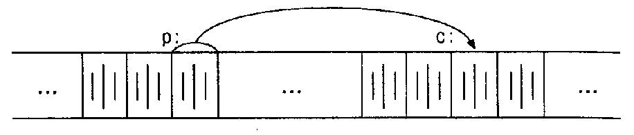

# Справочная информация

### Состояние "Write-What-Where \(запись-что-где\)"

Уязвимость — произвольной перезаписи памяти, или уязвимость известная, как уязвимость «запись-что-где» \(Write-What-Where\) — это любое условие, при котором злоумышленник может записать произвольное значение в произвольное место, часто в результате переполнения буфера. Это может быть использовано для перезаписи указателя функции, который позднее разыменовывается, заменяя его адресом памяти, к которому злоумышленник имеет законный доступ, куда он поместил вредоносный код, что приводит к выполнению произвольного кода.

### Указатели и массивы

**Указатель** - это переменная, содержащая адрес переменной. Указатели широко применяются в Си - отчасти потому, что в некоторых случаях без них просто не обойтись, а отчасти потому, что программы с ними обычно короче и эффективнее. Указатели и **массивы** тесно связаны друг с другом: в данной главе мы рассмотрим эту зависимость и покажем, как ею пользоваться. Наряду с goto указатели когда-то были объявлены лучшим средством для написания малопонятных программ. Так оно и есть, если ими пользоваться бездумно. Ведь очень легко получить указатель, указывающий на что-нибудь совсем нежелательное. При соблюдении же определенной дисциплины с помощью указателей можно достичь ясности и простоты. Мы попытаемся убедить вас в этом.

Изменения, внесенные стандартом ANSI, связаны в основном с формулированием точных правил, как работать с указателями. Стандарт узаконил накопленный положительный опыт программистов и удачные нововведения разработчиков компиляторов. Кроме того, взамен char\* в качестве типа обобщенного указателя предлагается тип void\* \(указатель на void\).

### Указатели и адреса

Начнем с того, что рассмотрим упрощенную схему организации памяти. Память типичной машины подставляет собой массив последовательно пронумерованных или проадресованных ячеек, с которыми можно работать по отдельности или связными кусками. Применительно к любой машине верны следующие утверждения: один байт может хранить значение типа char, двухбайтовые ячейки могут рассматриваться как целое типа short, а четырехбайтовые - как целые типа long. Указатель - это группа ячеек \(как правило, две или четыре\), в которых может храниться адрес. Так, если c имеет тип char, а p - указатель на c, то ситуация выглядит следующим образом:



Унарный оператор **&** выдает адрес объекта, так что инструкция `p = &c;`  присваивает переменной p адрес ячейки c \(говорят, что p указывает на c\). Оператор **&** применяется только к объектам, расположенным в памяти: к переменным и элементам массивов. Его операндом не может быть ни выражение, ни константа, ни регистровая переменная.

Унарный оператор **\*** есть оператор косвенного доступа. Примененный к указателю он выдает объект, на который данный указатель указывает. Предположим, что x и y имеют тип int, а ip – укаэатель на int. Следующие несколько строк придуманы специально для того, чтобы показать, каким образом объявляются указатели и как используются операторы **&** и **\***.

```c
int х = 1, у = 2, z[10];
int *ip;    /* ip - указатель на int */

ip = &x;    /* теперь ip указывает на x */
y = *ip;    /* y теперь равен 1 */
*ip = 0;    /* x теперь равен 0 */
ip = &z[0]; /* ip теперь указывает на z[0] */
```

Если ip указывает на x целочисленного типа, то \*ip можно использовать в любом месте, где допустимо применение x; например,

```c
*ip = *ip + 10;
```

увеличивает \*ip на 10. Унарные операторы **\*** и **&** имеют более высокий приоритет, чем арифметические операторы, так что присваивание

```c
y = *ip + 1;
```

берет то, на что указывает ip, и добавляет к нему 1, а результат присваивает переменной y. Аналогично 

```c
*ip += 1;
```

увеличивает на единицу то, на что указывает ip; те же действия выполняют

```c
++*ip;
```

и 

```c
(*iр)++;
```

В последней записи скобки необходимы, поскольку если их не будет, увеличится значение самого указателя, а не то, на что он указывает. Это обусловлено тем, что унарные операторы **\*** и **++** имеют одинаковый приоритет и порядок выполнения - справа налево.

И наконец, так как указатели сами являются переменными, в тексте они могут встречаться и без оператора косвенного доступа. Например, если iq есть другой указатель на int, то

```c
iq = ip;
```

копирует содержимое ip в iq, чтобы ip и iq указывали на один и тот же объект.

### 

