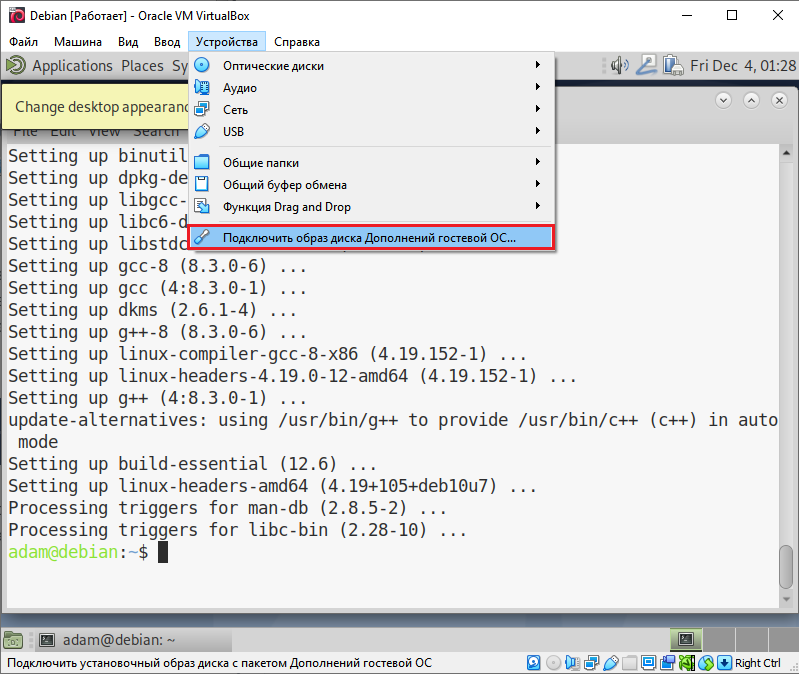

# Настройка ОС Debian 10.6.0

После запуска виртуальной машины и авторизации под учетной записью Администратора\( не суперпользователя - root\) необходимо запустить терминал. Это можно сделать при помощи нажатии комбинации клавиш **Ctrl + Alt + T.** 

### Добавление пользователя в группу администраторов

В операционной системе Linux терминал играет огромную роль в её администрировании. С её помощью можно, например, обновить операционную систему. Но сначала необходимо добавить пользователя\(не root\)  в группу администраторов "sudo". Для этого нужно в первую очередь авторизоваться под пользователем root  c помощью команды ниже в терминале:

```text
su -
```

После нажатия клавиши Enter нужно будет ввести пароль суперпользователя, который был задан при установке системы.  Чтобы добавить пользователя в группу достаточно ввести команду ниже, где usrname - имя пользователя. 

```text
echo "username  ALL=(ALL) ALL" | sudo tee /etc/sudoers.d/username && exit
```

 Теперь необходимо обновить все установленные в системы пакеты программ. Сделать это можно с помощью команды приведенной ниже.

```text
sudo apt update && sudo apt upgrade
```

После система запросит пароль пользователя. Это требуется для выполнения команды от имени суперпользователя. 


Для выполнения любой команды от имени суперпользователя достаточно добавить в начале команды слово "sudo"



### Установка гостевых дополнений

Установить гостевых дополненbz необходимо для наилучшего взаимодействия с операционной системой работающей в виртуальной машине VirtualBox. Их установка происходит в 2 этапа. На первом этапе нужно установить специальные пакеты. Сделать это можно с помощью следующей команды:  

```text
sudo apt install build-essential dkms linux-headers-$(uname -r)
```

Во втором этапе необходимо подключить оптический диск с гостевыми дополнениями к виртуальной машине. Это осуществляется через контекстное меню  виртуальной машины, как показано на рисунке ниже.



Далее необходимо ввести следующую команду чтобы установить гостевые дополнения.

```text
cd /media/cdrom && sudo sh ./VBoxLinuxAdditions.run --nox11
```

По завершении установки необходимо перезагрузить операционную систему введя в терминале соответствующую команду: 

```text
sudo reboot
```

### Установка пакетов 

#### VirtualBox

В первую очередь необходимо установить **VirtualBox.** Пакет с данной программой отсутствует в официальном репозитории. Поэтому сначала нужно настроить его настроить.

Следующие команды позволят добавить открытые ключи Oracle:

```text
wget -q https://www.virtualbox.org/download/oracle_vbox_2016.asc -O- | sudo apt-key add -
wget -q https://www.virtualbox.org/download/oracle_vbox.asc -O- | sudo apt-key add -
```

Затем нужно добавить строчку в конец файла /etc/apt/source.list. Сделать это можно с помощью команды указанной ниже:

```text
sudo add-apt-repository "deb http://download.virtualbox.org/virtualbox/debian buster contrib"
```


Если возникает ошибка "add-apt-repository: command not found", существует  два варианта решения проблемы: самостоятельно сделать запись в файле  /etc/apt/source.list или установить пакет "software-properties-common" с помощью программы apt.


Далее остается только лишь установить пакет с программой:  

```text
sudo apt update
sudo apt install virtualbox-6.0
```

#### Vargrant

Данная программа позволяет с легкостью устанавливать и настраивать виртуальные машины  VirtualBox через консоль. 

Для её установки достаточно выполнить следующую команду: 

```text
sudo apt install vagrant
```


