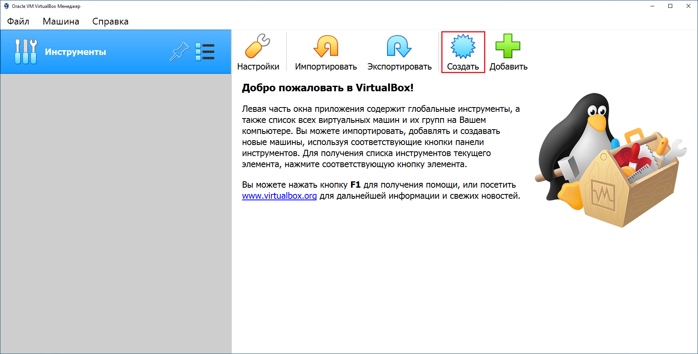
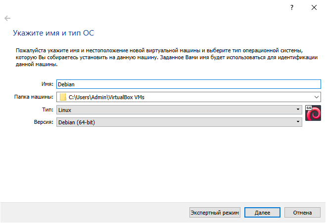
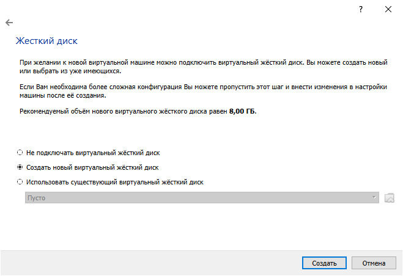
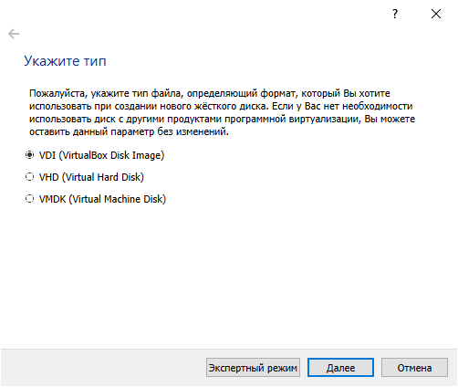
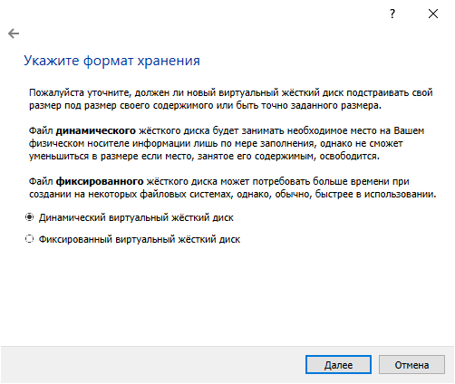
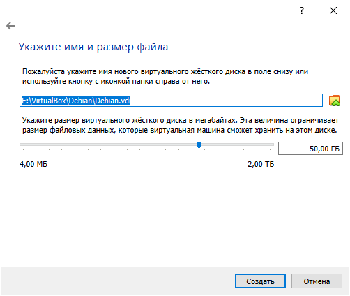

# Создание виртуальной машины

Для создания виртуальной машины необходимо запустить VirtualBox и нажать на кнопку "Создать", которая выделена рамкой красного цвета на рисунке 8.

В появившемся окне необходимо ввести в поле "Имя" слово Debian как показано на рисунке 9. VirtualBox на основе имени виртуальной машины автоматически подберет тип и версию операционной системы. Также можно указать другое местоположение файлов виртуальной машины в поле "Папка машины". 


Лучше изменить местоположение виртуальной машины, если на диске, где установлена операционная система, недостаточно свободного места.


Далее мастер создания виртуальной машины предложит указать объем оперативной памяти. В случае если в компьютере установлено 12 ГБ оперативной памяти, то для виртуальной машины рекомендуется  выделить не менее 8192 МБ. Но не стоит забывать о том, что для работы основной операционной системы оперативная память тоже необходима.  

Для работы виртуальной машины необходим виртуальный жесткий диск. Для его создания нужно выбрать параметр "Создать виртуальный жесткий диск" и нажать на кнопку "Далее".

На данном шаге можно оставить все как есть и нажать кнопку "Далее".

Динамический виртуальный жесткий диск следует использовать если его образ будет храниться на твердотельном накопителе. Фиксированный виртуальный жесткий диск лучше всего подойдет в случае если он будет храниться на жестком диске, у которого скорость чтения и записи на порядок меньше чем у твердотельного накопителя.   

На последнем шаге создания виртуальной машины необходимо указать имя и местоположение виртуального жесткого диска, а также его размер. Следует указать 50 ГБ. Этого будет достаточно для выполнения всех заданий данного практикума. 

