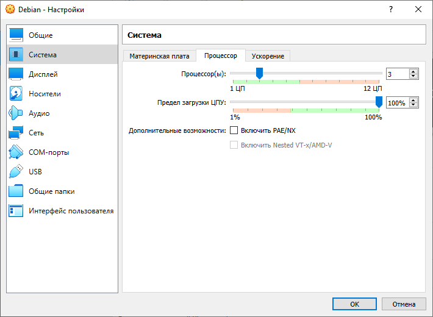
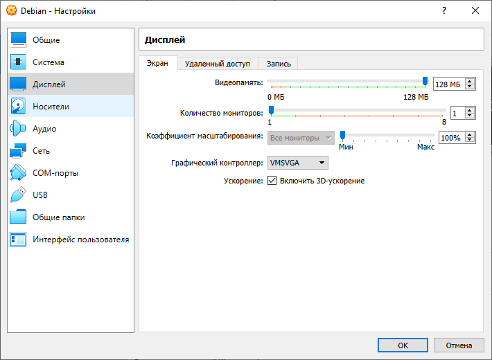

# Настройка виртуальной машины

Открыть окно с настройками виртуальной машины можно с помощью кнопки "Настроить" в главном окне программы VirtualBox, скриншот которого представлен на рисунке ниже. 

В первую очередь необходимо установить количество ядер для виртуального процессора машины. Данный параметр находиться во вкладке "Процессор" пункта меню настроек "Система". Изменение количества виртуальных ядер процессора осуществляется путем перемещения ползунка или явное указание их числа в поле параметра "Процессор\(ы\)" как показано на рисунке. Рекомендуется указывать число виртуальных ядер равных половине общего числа физических ядер компьютера.  

Далее необходимо настроить параметры дисплея. Для это нужно выбрать пункт меню "Дисплей" и во вкладке "Экран" передвинуть ползунок параметра "Видеопамять" в крайнее правое положении и установить галочку напротив параметра "Включить 3d-ускорение" как показано на рисунке 

Для того чтобы виртуальная машина определялась в сети как отдельное устройство необходимо во вкладке "Адаптер 1 " пункта меню "Сеть" тип подключения изменить на "Сетевой мост", а в пункте "Имя" выбрать сетевое устройство, которое используется компьютером для подключения к интернету. Результаты вышеперечисленных действий отображены на рисунке 

Чтобы сохранить настройки виртуальной машины достаточно нажать на кнопку "ОК".  

