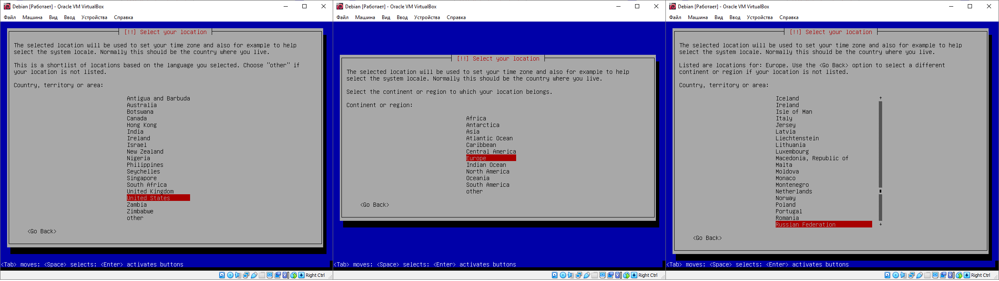
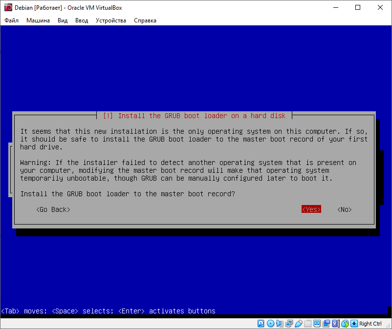

# Установка ОС Debian 10.6.0

В данном разделе подробно описан процесс установки операционной системы Debian 10.6.0 на виртуальной машине VirtualBox

## Подготовка к установке 

### Создание установочной флешки

Для установки операционной системы на компьютер нужна установочная флешка. А для создания установочной флешки нужен установочный образ операционной системы. Рекомендуется установить операционную систему  Debain в виду своей стабильности и распространенности по сравнению с другими дистрибутивами Linux.

Образ стабильной версии дистрибутива можно скачать с официального сайта по ссылке: [https://www.debian.org/index.ru.html](https://www.debian.org/index.ru.html)


Для создания установочного устройства необходимо соответствующее программное обеспечение. Наиболее популярным и простым в использовании инструментом для создания установочных флешек является Rufus. Скачать его можно на сайте [Rufus](https://github.com/pbatard/rufus).Его можно не устанавливать, а скачать и запустить портативную версию.


Для создания загрузочного устройства достаточно выбрать в разделе "Устройство"  флешку и  установочный образ разделе "Метод загрузки". После нажатия кнопки "СТАРТ" программа выдаст предупреждение в котором будет сказано об полном форматировании накопителя. Возможно будут появляться и другие окна и в таком случае рекомендуется руководствоваться логикой и указаниям программы.

### Сжатие свободного пространства

Проблем при установке любой операционной системы, как основной, обычное не возникает, но при часто возникают при установке рядом с операционной системой Windows . 

Основная проблема связанна с пространством куда будет установлена операционная система. Решить её достаточно просто в Windwos 10. Для этого необходимо выполнить следующие действия: 

1. Нажат одновременно клавиши **Win+R;**
2. Вести команду  **diskmgmt.msc** и нажать клавишу "Enter"
3. После выбрать раздел с наибольшим свободным местом, вызвать контекстное меню правой кнопкой мыши и выбрать пункт "Сжать том..." 
4. Параметр "Размер сжимаемого пространства \(МБ\)" установить размер выделяемого свободного пространства\(рекомендуется указать размер не менее 50 000 мегабайт\) 

### Отключение быстрой загрузки

 Отключение данного параметра позволит избежать проблем при установке второй операционной системы. Если операционная система Windows 10 установлена на жесткий диск \(HDD\) функция быстрой загрузки действительно уменьшает время загрузки операционной системы, но  в случае с твердотельными накопителями потребность в данной функции отпадает.

Для её отключения необходимо выполнить следующие действия: 

1. Нажать одновременно клавиши **Win+R;**
2. Вести команду  **diskmgmt.msc** и нажать клавишу "Enter";
3. После перейти в меню "Действия кнопки питания" нажав на соответствующий пункт меню в открывшимся окне;
4. Далее нажать на пункт "Изменение параметров , которые сейчас недоступны";
5. И снять галочку  параметра "Включить быстрый запуск \(рекомендуется\)";
6. Для сохранения параметров необходимо нажать на кнопку "Сохранить изменения".

### Загрузка с установочного носителя

Перед установкой операционной системы необходимо загрузиться с ранее созданного загрузочного носителя. Это можно сделать двумя способами: через загрузочное меню UEFI или меню восстановления Windwos 10. Самый простой путь лежит через меню восстановления Windows 10. 

Чтобы загрузиться в данное меню необходимо открыть параметры Windows. 


Далее перейти в раздел меню "Обновления и безопасность" и выбрать пункт "Восстановление". 


Для перехода в режим восстановления необходимо нажать на кнопку "Перезагрузить сейчас" в разделе "Особые варианты загрузки". После перезагрузки компьютера откроется меню восстановления. В данном меню необходимо нажать на пункт "**Использовать устройство**" и далее выбрать пункт меню содержащий имя производителя загрузочного устройства или название образа.

СКРИНШОТ

## Установка 


Использование Debian 10 в Virtualbox невозможно для выполнения лабораторных работ в виду отсутствия поддержки вложенной виртуализации у последнего.  



Для установки операционный системы нужно выбрать пункт меню "Install" и нажать на кнопку "Enter". После, инсталляционной программой будет предложено выбрать язык\(рисунок ниже\), который будет использоваться при  установке операционной системы, а потом и в самой операционной системе. Рекомендуется выбрать английский язык  во избежания проблем при работе с операционной системой.


Далее нужно будет выбрать регион. Регион "Russia" можно найти по следующем образом: "other" -&gt; "Europe"-&gt;"Russian Federation" или как показано на рисунке 



После выбора региона установщик попросил выбрать кодировку. В данном случае рекомендуется оставить значение по умолчанию: **"United States - en\_US.UTF-8"**. 

На этапе выбора раскладки клавиатуры также рекомендуется оставить настройки по-умолчанию: **"America keyboard".**


По окончание самонастройки установочная программа попросит ввести имя компьютера. В данном случае можно оставить значение по умолчанию. Поле "Domainname" также можно изменять.


Далее установочная программа попросит задать пароль суперпользователя, как показано на рисунке ниже. Пароль необходимо ввести два раза подряд


Сразу после того как будет задан пароль суперпользователя программа установки попросит задать имя учетной записи администратора. Рекомендуется указывать короткое имя пользователя.


Также как и для учетной записи суперпользователя необходимо задать пароль для учетной записи администратора. 


Не рекомендуется использовать одинаковый пароль для учетных записей суперпользователя и администратора.


Далее необходимо будет выбрать часовой пояс.


Затем программа установки предложит выбрать один из четырех способов разметки дискового пространства. Для обеспечения наилучшей производительности операционной системы рекомендуется выбрать первый вариант "**Guided - use entire disk**", как показано на рисунке ниже.


После необходимо выбрать схему разметки разделов. Рекомендуется выбрать первый вариант в виду просторы работы с данной схемой.  


Чтобы завершить настройку с разделами необходимо применить заданные параметры настроек. Для этого нужно в установочной программе выбрать параметр "Yes" и нажать клавишу "Enter" ,как показано на рисунке ниже.



Во время установки дистрибутива программа установки спросить разрешение провести сканирование других дисков в поиск дисков. В таком случае нужно выбрать параметр "No" и нажать на клавишу "Enter"


Затем необходимо выбрать страну и наиболее подходящее зеркало. В данном случае была выбрана страна Russian Federation, а адрес зеркала "mirror.docker.ru". Поле в настройках прокси-сервера рекомендуется оставить пустым.

После программа установки спросит разрешение на сбор статистики используемых пакетов Соглашаться не обязательно, что обычно и стоит делать. 


Далее программа установки предложит выбрать пользовательское  программное обеспечение, которое позже будет установлено на виртуальную машину. По умолчанию предлагается установить графическую оболочку и принт-сервер. В роли графической оболочки лучше выбрать "Mate" используя **Пробел** . А вот параметр принт-сервер лучше убрать, поскольку он не будет использоваться для работы. Чтобы продолжить установку с выбранными параметрами необходимо нажать на клавишу "**Tab**" и после клавишу "Enter".


После этого проследует процесс установки. Затем последует предложение установить загрузчик Grub. Рекомендуется согласиться.



Устройство куда будет установлен загрузчик следует выбрать с именем "/dev/sda", как показано на рисунке ниже 


Установив загрузчик и выполнив некоторые операции программа установки завершит свою работу и предложит перезагрузить устройство. На этом установка операционной системы Debian закончена.

## Настройка 

### Добавление пользователя в группу администраторов

В операционной системе Linux терминал играет огромную роль в её администрировании. С её помощью можно, например, обновить операционную систему. Но сначала необходимо добавить пользователя\(не root\)  в группу администраторов "sudo". Для этого нужно в первую очередь авторизоваться под пользователем root  c помощью команды ниже в терминале:

```text
su -
```

После нажатия клавиши Enter нужно будет ввести пароль суперпользователя, который был задан при установке системы.  Чтобы добавить пользователя в группу достаточно ввести команду ниже, где usrname - имя пользователя. 

```text
echo "username  ALL=(ALL) ALL" | sudo tee /etc/sudoers.d/username && exit
```

 Теперь необходимо обновить все установленные в системы пакеты программ. Сделать это можно с помощью команды приведенной ниже.

```text
sudo apt update && sudo apt upgrade
```

После система запросит пароль пользователя. Это требуется для выполнения команды от имени суперпользователя. 


Для выполнения любой команды от имени суперпользователя достаточно добавить в начале команды слово "sudo"



