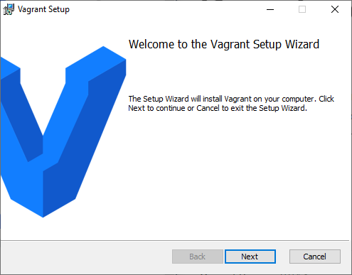
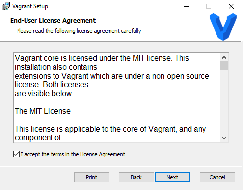
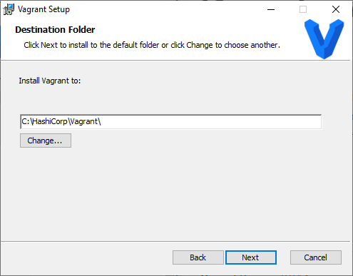
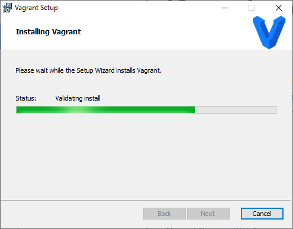

# Установка Vagrant

Vagrant - это инструмент для создания и управления средами виртуальных машин.

## Загрузка установочных файлов

Скачать установочный файл можно с [официального сайта](https://www.vagrantup.com/downloads) практически для любой платформы


## Установка Vagrant

### Windows 10

После запуска ранее скачанного файла появиться окно установочной программы Vagrant. Чтобы перейти к следующему шагу необходимо нажать на кнопку "**Next**"



Перед принятием лицензионного соглашения, рекомендуется с ним ознакомиться 



Далее необходимо указать директорию куда будет установлена программа, но лучше оставить исходное значение



Далее программа произведет установку всех необходимых компонентов 



Скриншот установочной программы представленный ниже знаменует успешное завершение процесса установки программы Vagrant


Для завершения установки программы необходимо перезагрузить компьютер.

### Debian 10

Для установки Vagrant на Debian 10 достаточно выполнить в терминале следующие команды: 

```text
sudo apt update
sudo apt upgrade
sudo apt install vagrant
```

###  Windows Subsystem for Linux 2\(Ubuntu 20.04\)

Установка Vagrant в WLS 2 такая же как и в Dedian, но требует дополнительных манипуляций после выполнения соответствующих команд. Необходимо в конец файла с именем ".bashrc", который находиться в домашней директории, добавить следующие строчки:  

```text
export VAGRANT_WSL_ENABLE_WINDOWS_ACCESS="1"
export PATH="$PATH:/mnt/c/Program Files/Oracle/VirtualBox"
```

Первая строчка включает включает функцию использования Vagrant в  WSL 2. Вторая позволяет Vagrant узнать путь куда установлено программное обеспечение VirtualBox.

