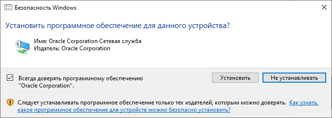

# Установка VirtualBox

## Загрузка установочных файлов

В первую очередь необходимо скачать установочный пакет  VirtualBox с [официального сайта](https://www.virtualbox.org/wiki/Downloads) производителя, страница которого показана на рисунке 2. 


Скачать установочный пакет для операционной системы Windows 10 можно перейдя по ссылке [Windows hosts](https://download.virtualbox.org/virtualbox/6.1.16/VirtualBox-6.1.16-140961-Win.exe).

## Установка VirtualBox

### Windows 10

Запустив файл откроется окно установочной программы VirtualBox как показано на рисунке 3.


Далее необходимо нажать на кнопку "Next". После чего появиться возможность включить или исключить компоненты программы из сценария установки\(Рисунок 4\). Также можно изменить путь куда будет установлена программа. Без крайней необходимости лучше ничего не менять и нажать на кнопку "Next".


После программа установки предложит выбрать дополнительные параметры установки программы. И  выбрать их нужно в соответствии тем как показано на рисунке 5 . Параметр "Create a shortcut on the desktop" отвечает за создание ярлыка программы VirtualBox на рабочем столе, а параметр "Register file associations"  за ассоциацию фалов имеющих расширение ova, vdi и т.д. c программой Virtualbox. 


По окончании установки галочек перед рекомендуемыми параметрами нужно нажимать кнопку "Next" до появления окна, скриншот которого представлен на рисунке 6. В данном окне необходимо установить галочку напротив "Всегда доверять программному обеспечению "Oracle Corporation" и нажать на кнопку с подписью "Установить".



По окончании установки окно установочной программы будет выглядеть как показано на рисунке  7.


Для закрытия программы установки VirtualBox нужно нажать на кнопку "Finish". Программа VirtualBox запустится сразу после нажатия кнопки "Finish" если напротив пункта "Start Oracle VM VirtualBox 6.1.16 after installation" будет стоять галочка.

### WSL 

Устанавливать VirtualBox в WSL бесполезно и связанно это в первую очередь с тем, что WSL не является полноценной системой Linux и представляет с собой виртуальную машину в которой функционирует ядро Linux.  

Одним из преимуществ WSL является  возможность запуска программ Windows прямо из среды Linux. И благодаря этой возможности достаточно установить Virtualbox воспользовавшись инструкцией выше. 

### Debian 10.6

В первую очередь необходимо обновить индексы репозитория операционной системы с помощь команды приведенной ниже:

```text
sudo apt update
```

Далее необходимо импортировать ключ GPG для репозитория VirtualBox

```text
wget -q https://www.virtualbox.org/download/oracle_vbox_2016.asc -O- | sudo apt-key add -
```

В случае успешного выполнения команда выше вернёт значение "**ОК**".

После необходимо добавить репозиторий VirtualBox в список источников. 

```text
echo "deb [arch=amd64] http://download.virtualbox.org/virtualbox/debian bionic contrib" | sudo tee /etc/apt/sources.list.d/virtualbox.list
```

После выполнения команды выше необходимо обновить индексы репозитория системы

```text
sudo apt update
```

Последняя команда позволит установить сам VirtualBox

```text
sudo apt install virtualbox-6.0
```


На момент написания практикума Vagrant не умеет работать с версией VitrualBox  6.1 и выше


